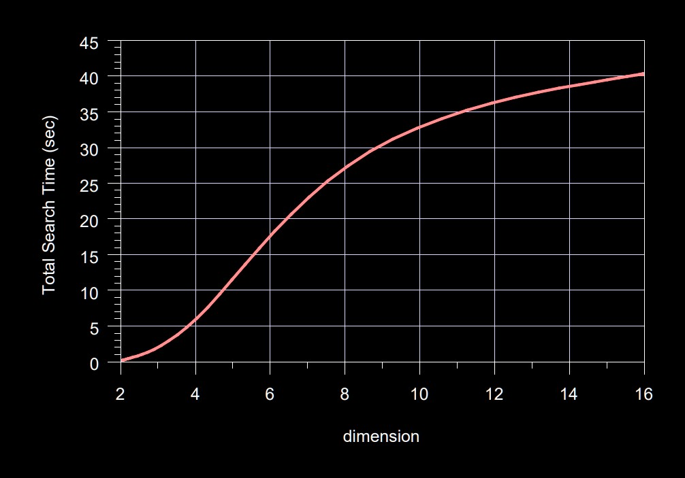
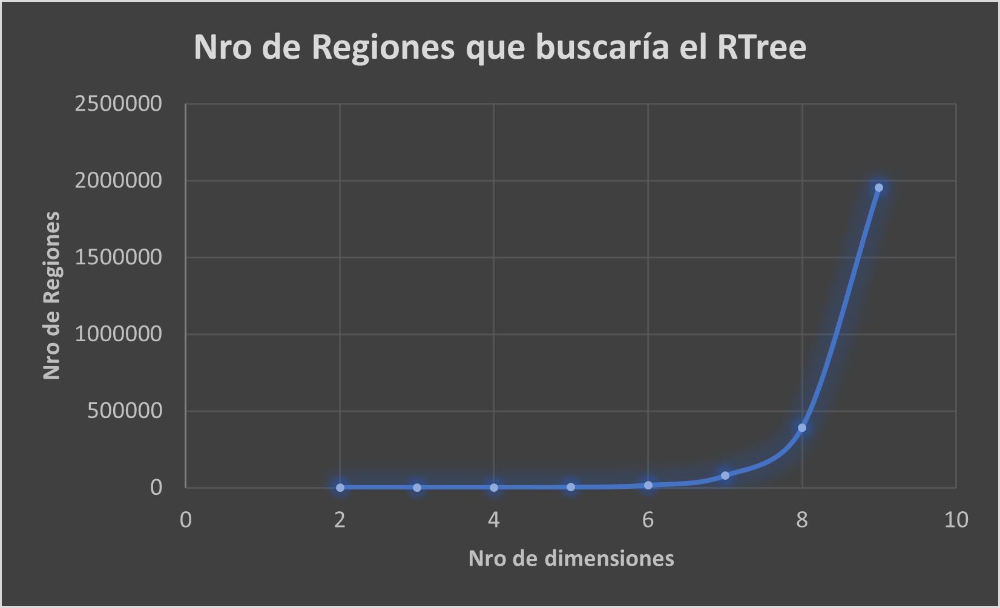
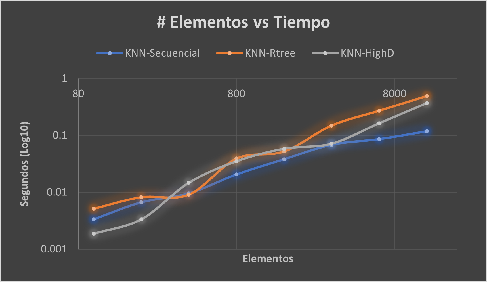

<h1 align="center">
  <br>
  <br>
  Proyecto 2 de Base de Datos 2
  <br>
</h1>
<p align="center">
  
  
  
  
  
</p>
<!-- 
TODO: colocar el gif
<h1 align="center">
  <a href="#"></a>
</h1> -->


## Integrantes

| Apellidos y Nombres       | Código de alumno | % Participación |
|---------------------------|------------------|-----------------|
| Morales Panitz, Alexander | 202020195        | 100%            |
| Ugarte Quispe, Grover     | 202020159        | 100%            |
| Gutierrez Guanilo, Luis   | 202010074        | 100%            |

# Enlace a video: 

## Librerías utilizadas

### Listado de librerías

Para la interfaz requerimos:
- Flask: manipulación de web

Para aplicar los métodos listados, es necesario contar con las siguientes liberías.

- heapq: Permite operaciones de una cola de prioridades
- face_recognition: Nos permite procesar archivos de imágenes y retornarlas como vectores (codificación)
- numpy: Nos permite manipular imágenes como vectores, además las liberías siguientes requieren entradas con arreglos de esta librería
- rtree: Nos permite acceder a un objeto **rtree** y todas sus funciones para indexación multidimensional
- sklearn.neighbors: Nos permite acceder a un objeto **kdtree** y todas sus funciones para indexación multidimensional

### Realización de algoritmos en base a estructuras

#### Secuencial

En una estructura secuencial, recorremos todo el espacio de elementos de forma lineal de manera que si algún elemento cumple los requerimientos que el algoritmo solicita, este será incluido para su retorno. Se encuentra definido en el proyecto como la clase ```KNN```.

##### KNN search

```py
def _priority_search(self,Q : np.ndarray, D : dict, k : int)
```
Es un método que requiere del espacio de imágenes en forma de vectores y la cantidad *k* de elementos a retornar que más se acerquen al objeto en cuestión. Para facilitar la inserción ordenada, empleamos la librería estandar de python **heapq** de manera que nos permita hacer las funciones básicas **push** a la lista *result* y finalmente seleccionamos aquellos **k** elementos con menor distancia euclidiana.
```py
import heapq

result = []
for id, row in D.items():
    dist = euclidean_distance(Q, row)
    heapq.heappush(result, priority_tuple(id, dist))
return result[:k]
```

Adicionalmente, para permitir que el heap realiza comparaciones con las tuplas ingresadas, se debe crear una clase ```priority_tuple``` que sobrecarga operadores de comparación. De esa manera, los métodos heapq saben como comparar los objetos que almacenan el identificador de la imagen y su respectiva distancia.   

```py
class priority_tuple:
    def __init__(self, _id, _dist) -> None:
        self.id = _id
        self.dist = _dist
    def __lt__(self, ot):
        return self.dist < ot.dist
    def __le__(self, ot):
        return self.dist <= ot.dist
    def __eq__(self, ot):
        return self.dist == ot.dist
    def __ne__(self, ot):
        return self.dist != ot.dist
    def __gt__(self, ot):
        return self.dist > ot.dist
    def __ge__(self, ot):
        return self.dist >= ot.dist
```

##### Range search

```py
def _range_search(self,Q : np.ndarray, D : dict, r : float):
```

Al igual que en KNN search, requerimos de la imagen a consultar, el espacio de imágenes y el radio máximo que una imagen puede encontrarse distanciada de otra. De manera que no existe un número definido de coincidencias que se retornarán ya que ello depende del radio. 

```py
    result = []
    for id, row in D.items():
        dist = euclidean_distance(Q, row)
        if dist < r:
            result.append((id, dist))
    return result
```

#### RTree

En una estructura RTree, empleamos la estructura de datos que lleva el mismo nombre, la cual tiene la capacidad de permitir facilidad en la manipulación de índices multidimensionales. Recordemos que comparte similaridades con un B-Tree. La clase que define sus algoritmos está denominada como **KNN_Rtree**.

##### KNN search
Para obtener los K elementos más cercanos a la consulta en cuestión, empleamos métodos que provienen de la misma librería que nos permite emplear un Rtree. 
```py
(method) nearest: (coordinates: Any, num_results: int = 1, objects: bool = False) -> (Any | Generator[Any, None, None])
```
Con este método, lo empleamos para crear un método de la clase mencionada anteriormente.

```py
def get(self,Q: np.ndarray,data_encoding : dict, k: int):
    output = []
    keys = list(data_encoding.keys())
    self._build(data_encoding=data_encoding)
    query = tuple(Q)
    for p in self._ind.nearest(query, num_results=k):
        output.append((keys[p], self._ind.bounds[p]))
    return output
```

Recordemos que para que la estructura RTree funcione adecuadamente, es necesario que cree un archivo que almacene el índice creado mediante el espacio de imágenes proveído. Esta información se genera de acuerdo a archivos *.data* y *.index*.
```py
def _build(self, data_encoding : dict):
    if os.path.exists("puntos.data"):
        os.remove("puntos.data")
    if os.path.exists("puntos.index"):
        os.remove("puntos.index")
    prop = rtree.index.Property()
    prop.dimension = 128
    prop.buffering_capacity = 3
    prop.dat_extension = "data"
    prop.idx_extension = "index"
    self._ind = rtree.index.Index("puntos", properties=prop)
    for i, value in enumerate(data_encoding.values()):
        self._ind.insert(i, tuple(value))
```

#### HighD

Para emplear métodos basados en la estructura HighD que eviten la maldición de la dimensionalidad, existen las siguientes aplicaciones:
- PCA
- KDTree
- LSH
- Faiss

Para esta ocasión, hemos empleado un KDTree, cuyos métodos y procedimientos son proveídos por la libería **sklearn** en el sub-módulo **neighbors**. Con esto en cuenta, diseñamos un método para la clase denominada KD_Tree que representa la asimilación de KNN-HighD.

##### KNN search

La clase KDTree de sklearn permite realizar consultas KNN mediante el método **query**. Empleamos este método para crear la función que procese consultas KNN.

```py
def get_knn(self,data_encoding : dict, Q: np.ndarray, k, leaf_size=3)
```

- data_encoding: El espacio de imágenes expresado como una serie de puntos
- Q: La imagenn expresada como un punto a buscar
- k: cantidad de elementos similares a retornar
- leaf_size: Cantidad de puntos que el KDTree almacenará por hoja

```py
output = []
keys = list(data_encoding.keys())
enconding = list(data_encoding.values())
tree = KDTree(enconding, leaf_size=leaf_size)
q_reshaped = Q.reshape(1,-1)
dist, ind = tree.query(q_reshaped, k)
for indexes in ind[0]:
    output.append(keys[indexes])
return output
```

##### Range Search

La clase KDTree de sklearn permite realizar consultas KNN mediante el método **query_radius**. Empleamos este método para crear la función que procese consultas KNN.

```py
def get_radius(self,data_encoding : dict, Q: np.ndarray, r, leaf_size=3)
```

- data_encoding: El espacio de imágenes expresado como una serie de puntos
- Q: La imagenn expresada como un punto a buscar
- r: tamaño de la distancia máxima para hallar similaridades
- leaf_size: Cantidad de puntos que el KDTree almacenará por hoja

```py
output = []
keys = list(data_encoding.keys())
enconding = list(data_encoding.values())
tree = KDTree(enconding, leaf_size=leaf_size)
q_reshaped = Q.reshape(1,-1)
ind = tree.query_radius(q_reshaped, r)
for indexes in ind[0]:
    output.append(keys[indexes])
return output
```


## Maldición de dimensionalidad

### Análisis

Para mostrar la maldición de la dimensionalidad es necesario evaluar el desempeño del RTree con un espacio de atributos constantes a medida que cada tupla cuenta con un atributo adicional (Simulamos de que 1 dimensión es un atributo en una tupla). Recordemos de que el RTree se pudo visualizar cuando se aplicaba en datos bi-dimensionales y mostraba eficacia al momento de realizar búsquedas y la construcción de la estructura. No obstante,  al visualizar el desempeño del RTree con respecto al incremento de la dimensionalidad, se aprecia lo siguiente:

**Imagen obtenida de** <a href="https://bib.dbvis.de/uploadedFiles/190.pdf"><em>An Index Structure for High-Dimensional Data</em></a>
<a href="https://bib.dbvis.de/uploadedFiles/190.pdf"></a>

Como se aprecia, a medida que incrementan las dimensiones en el estudio referenciado, el tiempo de procesamiento incrementa de manera *exponencial*. Esto es debido principalmente a la región total en donde opera el RTree. Ya que el RTree opera mediante a areas del espacio vectorial completo donde se encuentran los datos, simulemos cuantos espacios tendría que abarcar dependiendo de la cantidad de dimensiones, suponiendo que evalúa por 1 unidad en un máximo de 5 unidades por eje (EJM: en un espacio 2d, existen 25 regiones que abarcaría el RTree).

| #Dimensiones | #Regiones |
|--------------|-----------|
| 2            | 25        |
| 3            | 125       |
| 4            | 625       |
| 5            | 3125      |
| 6            | 15625     |
| 7            | 78125     |
| 8            | 390625    |
| 9            | 1953125   |



Por medio de la interpretación mediante la visualización de la gráfica, observamos de que la cantidad de regiones (**R**) en el ejemplo dado viene se mide por la función **R = 5\*\*d**. Por ende, en un espacio con **D** dimesiones, el RTree tendría que abarcar **R = N\*\*D** regiones, donde **N** equivale a **|(- min(atributo) , + max(atributo))|**. Por lo que sus operaciones de búsqueda, construcción e inserción aumentarían de forma exponencial dependiendo de la cantidad de atributos.

### Mitigación

Pese a que no se puede contrarrestar esta teoría en su totalidad, existen algunos métodos y modificaciones que permitirían que el RTree pueda disminuir su complejidad de sus operaciones.

#### Modificación en la obtención de distancias

Para evitar el tiempo excesivo en el cálculo de distancias, se prefiere utilizar una expresión de Minkowski que emplee un exponente mínimo (EJ: 1, 2, 3,4). Incluso, es preferible emplear la distancia Manhttan, demanera que solo es necesario realizar la sumatoria de las diferencias entre la consulta y las regiones del RTree.

#### Reducción en la cantidad de dimensiones (atributos)

Se basa en agrupar de alguna manera ciertos atributos de manera que se pueda obtener un dataset que disminuya la dimensionalidad.

Supongamos que tenemos una tabla de la siguiente manera:

| Temperatura | Masa | distanciaZ | distanciaX | distanciaY |
|-------------|------|------------|------------|------------|
| 60          | 15   | 5          | 3          | 4          |
| 20          | 2    | 4          | 4          | 0          |
| 4           | 1    | 3          | 0          | 5          |
| 87          | 12   | 0          | 4          | 1          |
| 70          | 18   | 5          | 0          | 1          |
| 100         | 21   | 3          | 0          | 3          |
| 5           | 24   | 3          | 0          | 3          |
| 31          | 0    | 2          | 5          | 0          |
| 96          | 10   | 3          | 5          | 2          |

Si esta tabla es ubicada en un RTree, el espacio a buscar dado una tupla nueva sería de:
- Temperatura: 100 - 3 = 97
- Masa: 24 - 0 = 24
- DistanciaZ: 5 - 0 = 5
- DistanciaY: 5 - 0 = 5
- DistanciaX: 5 - 0 = 5
- **NRO DE REGIONES** = 97 x 24 x 5 x 5 x 5 = **291,000**

Ahora, reduzcamos los atributos de distancia realizando un producto triple y ubicandolos en un nuevo atributo denominado Volumen.

| Temperatura | Masa | Volumen |
|-------------|------|---------|
| 60          | 15   | 60      |
| 20          | 2    | 0       |
| 4           | 1    | 0       |
| 87          | 12   | 0       |
| 70          | 18   | 0       |
| 100         | 21   | 0       |
| 5           | 24   | 0       |
| 31          | 0    | 0       |
| 96          | 10   | 30      |

La cantidad de regiones que abarcaría el RTree sería de:
- Temperatura: 100 - 3 = 97
- Masa: 24 - 0 = 24
- Volumen: 60 - 0 = 60
- **NRO DE REGIONES** = 97 x 24 x 60 = **139,680**

Existe una reducción de regiones en un 48% con respecto a la cantidad original. Lo cual permitiría que el RTree con esta nueva table pueda realizar sus operaciones con un menor tiempo.

#### Aproximación de valores (KNN Aproximado)

Un KNN aproximado consiste básicamente en realizar una agrupación de aquellas tuplas que tengan mayores similaridades y posicionarlas en contenedores específicos. De manera que cuentan como una sola tupla y el espacio de datos del RTree disminuya al tener que ubicar menos datos. No obstante, se sabe de que el resultado con respecto a los datos originales no necesariamente será parte de los más cercanos.

## Experimentación en segundos

### Tabla de resultados (K=8)

Se registran resultados de las búsquedas KNN para los tres modelos discutidos con anterioridad.

| Elementos | KNN-Secuencial | KNN-Rtree | KNN-HighD |
| --------- | -------------- | --------- | --------- |
| 100       | 0.003347       | 0.005153  | 0.001862  |
| 200       | 0.006651       | 0.008214  | 0.003338  |
| 400       | 0.009577       | 0.009137  | 0.014684  |
| 800       | 0.020565       | 0.039126  | 0.034979  |
| 1600      | 0.038080       | 0.052313  | 0.058327  |
| 3200      | 0.068557       | 0.149235  | 0.071465  |
| 6400      | 0.085998       | 0.272013  | 0.163756  |
| 12800     | 0.118353       | 0.492177  | 0.368989  |

### Gráfica de resultados



### Comentarios

Podemos apreciar lo siguiente:
- El Rtree es la estructura que presenta la mayor cantidad de tiempo entre todas. Esto puede ser debido a la **maldición de la dimensionalidad**. 
- El método HighD a través del KD-Tree se mantiene inferior a la búsqueda secuencial, no obstante, comienza a acercarse al desempeño del RTree a medida que se agregan más elementos a su espacio de búsqueda.
- El método secuencial es aquel que se mantiene con inferioridad la mayor parte del tiempo, no obstante, sabemos de que el KD-Tree y RTree son estructuras de búsqueda multidimensional cuando existen datos masivos. Se tiene la hipótesis de que a apartir del rango del millon, el posicionamiento de búsquedas eficientes se defina mediante:
    1. KD-Tree (Debido a la maldición del Rtree)
    2. Rtree
    3. Secuencial
- Se reitera el hecho de que la búsqueda secuencial se favorece al tener una cantidad de elementos (máximo 128000) favorabl. No obstante en un entorno real, la cantidad de elementos (imágenes) supera exponencialmente a la utilizada en la experimentación. De esa forma justificando la creación del RTree y KDTree.